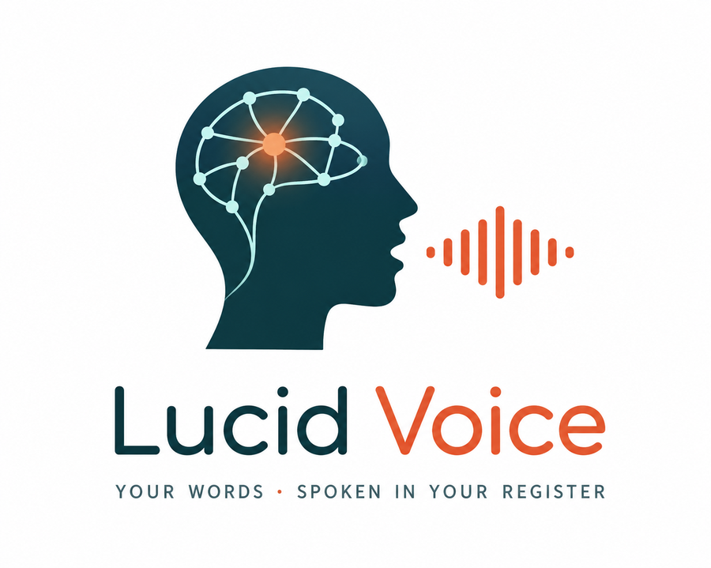
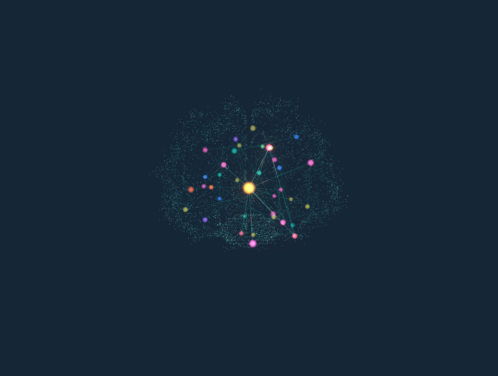

<div align="center">



### Speak again — in your own voice.

**A local-first AAC app that turns 2–3 tapped words into a full, situationally‑correct sentence — spoken in a cloned version of the user's own voice.**

<br/>



<sub>The user's personal memory graph, rendered as a living brain. The exact memories that grounded a reply light up in real time.</sub>

</div>

---

## What it is

People who can't speak fluently — after a stroke (aphasia), with ALS, or autism — communicate on tap‑boards at roughly **8 words per minute**. Ordinary speech is about **150**.

Lucid Voice closes that gap. The person taps a couple of word‑fragments; an AI **reconstructs several full, register‑correct candidate sentences** grounded in their personal life‑context; they **select one**, and it's spoken aloud in a clone of their own voice. Everything that matters runs **on‑device**, so it keeps working in airplane mode.

> **AAC** = Augmentative & Alternative Communication.

## The thesis — and the moat

> **The same minimal input produces a *different, correctly‑registered* reply depending on _who is listening_.**

That's the whole idea, and it's the part a generic LLM prompt can't reliably do from two words:

| She taps | Partner | Lucid Voice speaks |
|---|---|---|
| `tired · maybe` | **Sofia** (daughter) | *"I'd love to, **sweetie**, but I've been so tired lately. Can I tell you Saturday?"* |
| `tired · maybe` | **Mateo** (grandson, 4) | *"I'm a little tired right now, **mijo**. Maybe after my nap? I love you."* |

Identical input. The wording, the term of endearment, even the promise of a nap — all pulled from a **personal knowledge graph**, not invented. The moat is the **personal‑memory layer + on‑device privacy + the user's own preserved voice**, not the text generation.

## How it works

```
   ┌── Tap ──────────┐   ┌── Ground ─────────────┐   ┌── Reconstruct ───────┐   ┌── Speak ──────────┐
   │ 2–3 vocab tiles  │   │ Hybrid GraphRAG over   │   │ Claude writes 3       │   │ You select one →   │
   │ (or the partner's│ → │ your personal graph +  │ → │ register-correct      │ → │ it plays in your    │
   │ line via STT)    │   │ partner detection      │   │ candidates, grounded  │   │ cloned voice — and  │
   │                  │   │ → abstain if unsure    │   │ in your facts         │   │ the graph learns    │
   └──────────────────┘   └────────────────────────┘   └───────────────────────┘   └─────────────────────┘
```

1. **Tap** word‑fragments on a calm vocabulary board, or capture what the partner said with the mic (speech‑to‑text). Composition is tiles‑first — the assisted user never *has* to type (an optional type‑to‑add field is there if they want it).
2. **Ground** — `retrieval.py` runs a hybrid **GraphRAG**: anchor the fragments to graph nodes, detect *who* is being spoken to, expand the neighbourhood, blend in vector search, re‑rank, and select a low‑redundancy fact set. If confidence is too low it **abstains** ("add one more word") rather than guessing.
3. **Reconstruct** — `generation.py` asks the LLM for exactly three candidates at different lengths/registers, grounded in the retrieved facts. A learned **personal style model** re‑ranks them (server‑side) to sound like *you*, and a **tone dial** (warm / even / direct / playful) lets you nudge which register floats to the top.
4. **Speak** — selecting a candidate plays it aloud (cloned‑audio‑first, with an on‑device system‑voice fallback so it's never silent), fires `/confirm`, and **reinforces the memory graph** so it gets better over time.

## Features

- 🧠 **Personal Knowledge Graph (PKG)** — an embedded [Kuzu](https://kuzudb.com/) graph of the people, places, routines, preferences and phrases that make replies sound like you.
- 🎭 **Register that fits the listener** — partner detection drives the term of address ("sweetie" / "mijo" / "mi amor") and tone.
- 🗣️ **Your own voice** — zero‑shot voice cloning (Coqui XTTS‑v2), cache‑first so confirmed lines replay instantly and offline. Playback is cloned‑audio‑first; until a voice is enrolled it gracefully uses the best on‑device system voice.
- 🌀 **Show your work** — a 3D **hologram‑brain** view (`/graph`) where the retrieved memories *fire* the path that grounded each reply. Plus **"Build your brain,"** where a warm AI interviews you and each answer **blooms** a new memory onto the graph, live.
- 📈 **Online learning loop** — every confirmation reinforces the graph; a consolidation pass promotes recurring patterns into durable preferences; and a scheduled decay pass (`run_decay`) fades what goes unused.
- ✈️ **On‑device & airplane‑mode capable** — local LLM, STT, TTS, embeddings and graph. Cloud providers are strictly opt‑in.

## Architecture

```
 Frontend  (Vite · React · TypeScript · Tailwind · three.js)        :5173
 ├── Conversation  /        the unified turn-loop (capture → tap → generate → select → speak)
 └── Graph         /graph   the 3D hologram brain + "Build your brain"
        │  fetch /api/*  (Vite proxies /api → :8000)
 Backend   (FastAPI · Python)                                       :8000
 ├── retrieval.py   hybrid GraphRAG (anchor → expand → vector → rerank → submodular → abstain)
 ├── generation.py  LLM candidate generation (strict JSON, repair retry, fallback)
 ├── style.py       per-user learned communication-style model
 ├── graph.py       Personal Knowledge Graph (Kuzu)
 ├── learning.py    online learning (/confirm reinforce · /consolidate · decay)
 ├── cache.py       cache-first /speak (pre-rendered demo audio)
 └── providers/     local-first LLM · embedding · STT · TTS (cloud opt-in)
```

Every backend service is built **lazily and degrades gracefully** — the app boots and serves end‑to‑end even with no LLM / graph / TTS installed (returning correctly‑shaped placeholders), which is what makes it demo‑safe.

### Tech stack

| Layer | Default (on‑device) | Opt‑in cloud |
|---|---|---|
| **LLM** | LM Studio (OpenAI‑compatible, `:1234`) | Anthropic **Claude** |
| **Embeddings** | sentence‑transformers (`bge‑small`) | — |
| **Speech‑to‑text** | faster‑whisper | **Deepgram** |
| **Voice clone / TTS** | Coqui **XTTS‑v2** | **ElevenLabs** |
| **Graph DB** | Kuzu (embedded) | — |

Cloud providers are reached **only** when you set their provider env var and supply an API key; with zero keys, everything runs locally.

### API

`/health` · `/generate` · `/speak` · `/confirm` · `/assistant_turn` · `/consolidate` · `/style/{person_id}` · `/stt` · `/enroll` · `/graph/{person_id}` · `/trace/latest`

## Quickstart

```bash
cd aac
./run.sh
```

`run.sh` creates/reuses a virtualenv, installs backend + frontend deps if needed, copies `.env.example` → `.env`, and starts both servers together.

- **Frontend:** http://localhost:5173
- **Backend API:** http://localhost:8000

### Prerequisites

- **Python 3.10+** and **Node 18+**
- **FFmpeg** — required by local voice synthesis (`brew install ffmpeg`). Without it, `/speak` still serves cached audio and degrades gracefully.
- **LM Studio** serving any instruct model on `:1234` — *only* needed for live (non‑`DEMO_MODE`) generation.

> First run pulls heavy ML weights (XTTS‑v2 ≈ 1.8 GB); they cache after that. Or set `DEMO_MODE=true` in `aac/backend/.env` to skip all of it.

### Manual run

```bash
# Backend
cd aac/backend && python3 -m venv .venv && source .venv/bin/activate
pip install -r requirements.txt && cp .env.example .env
uvicorn app.main:app --reload --port 8000

# Frontend (second terminal)
cd aac/frontend && npm install && npm run dev
```

### Giving someone a cloned voice

```bash
cd aac/backend
python -m data.enroll_voice elena path/to/elena.wav   # a clean ~10s reference
python -m data.prerender_demo elena                   # pre-render demo lines into the cache
```

## Project structure

```
aac/
├── backend/
│   ├── app/
│   │   ├── main.py            FastAPI app + endpoints + lazy DI
│   │   ├── services/          retrieval · generation · style · graph · learning · cache
│   │   └── providers/         llm · embedding · stt · tts (local-first, cloud opt-in)
│   └── data/                  seed_graph · enroll_voice · prerender_demo · fixtures
├── frontend/
│   └── src/
│       ├── views/             ConversationView (primary) · GraphView
│       ├── components/        HologramBrain · BuildBrainPanel · CandidateCard · VocabBoard · …
│       ├── hooks/useSpeak.ts  cloned-audio-first playback, browser-voice fallback
│       └── lib/               api · demo (offline fallback) · motion tokens
└── run.sh                     one-command dev launcher
```

## Design language

Two characters, two colors: **coral = the human** (your words, your voice, your chosen sentence) and **teal = the machine** (its reasoning and state). A reading serif is reserved for the spoken human sentence; mono is the machine's instrument output. Calm, legible, AAC‑first — large targets, colour never the only signal, motion that conveys a transition rather than decoration, and reduced‑motion honored throughout.

## Status

Built as a demo‑first hackathon project. Running today: the unified Conversation surface with a real speech‑to‑text turn‑loop, the 3D memory brain + "Build your brain," cloned‑voice playback (with a graceful browser‑voice fallback), and a polished, accessible UI.

---

<div align="center"><sub>Sponsor fit — ElevenLabs (voice) · Deepgram (STT) · Claude (reasoning).</sub></div>
